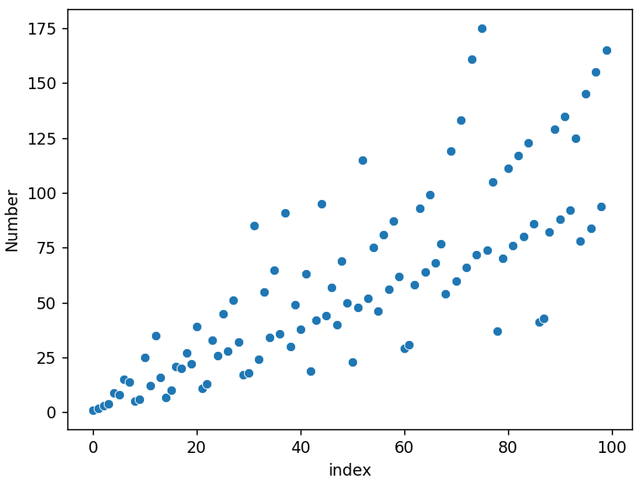
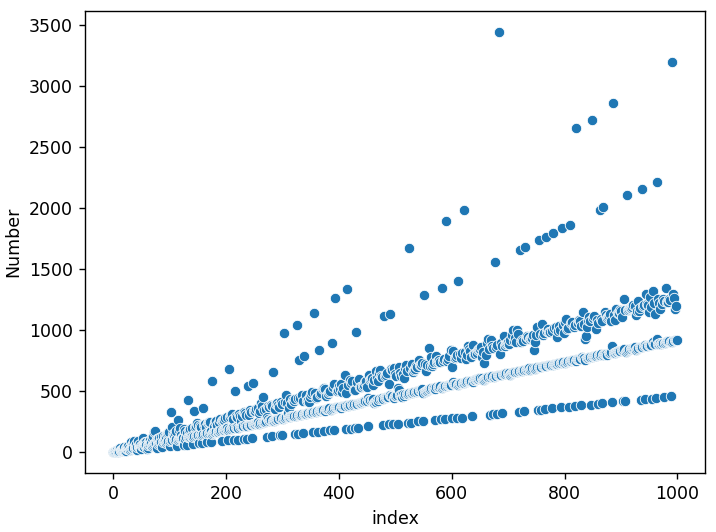

# the-yellowstone-permutation
This script generates [the Yellowstone Permutation](https://www.youtube.com/watch?v=DUaqiM1bGX4). 

output: `[1, 2, 3, 4, 9, 8, 15, 14, 5, 6, 25, 12, 35, 16, 7, 10, 21, 20, 27, 22]`

# Plotting with Seaborn
## Basic Scatterplots
Scatterplot of 100 numbers:

Scatterplot of 1000 numbers:

Scatterplot of 10,000 numbers:
